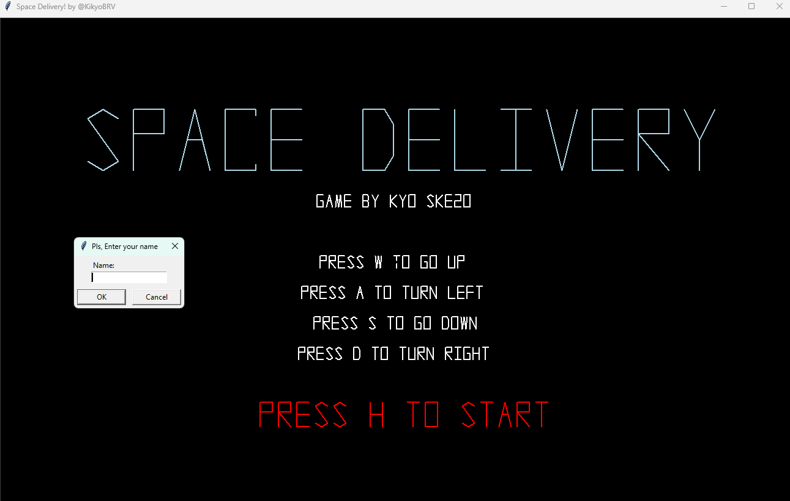
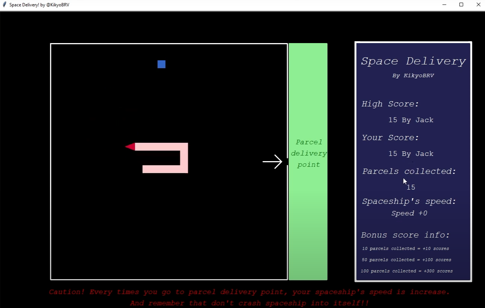

# SpaceDelivery

  SpaceDelivery is a game inspired by the "snake game," but I have modified and added some rules. In this game, players control a spaceship that must collect parcels and deliver them to designated delivery points. Players earn bonus points based on the number of parcels the spaceship is carrying. Each time a player delivers parcels to a delivery point, the spaceship's speed increases, making the game more challenging and requiring players to strategize before delivering parcels.

  This is my Computer Programming 1 project (done since my first year of undergraduate studies, first semester). Therefore, this project is considered my first attempt at making a game using Python.



### How to run the program
1. Open cmd/PowerShell/terminal
2. Clone the repository
```
git clone https://github.com/KikyoBRV/WorldData.git](https://github.com/KikyoBRV/SpaceDelivery.git
```
3. Change your directory to SpaceDelivery
```
cd SpaceDelivery
```
4. Create virtual environment
```
# Create virtual environment
python -m venv venv

# Activate virtual environment
# On MacOS/Linux:
source venv/bin/activate
# On Windows:
venv\Scripts\activate
```
5. Run the application
```
# On MacOS
python3 main.py

# On MS Windows
python main.py
```
